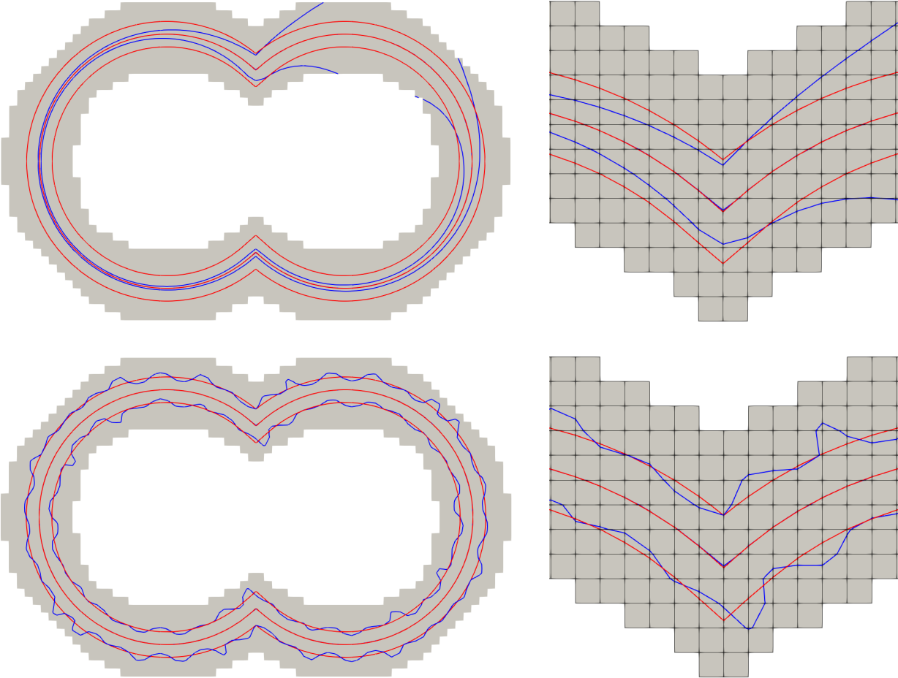

# A new finite element level set reinitialization method based on the shifted boundary method
<p align="center">
  
</p>

This repository contains an implementation of our paper on _Journal of Computational Physics_: "[A new finite element level set reinitialization method based on the shifted boundary method](https://doi.org/10.1016/j.jcp.2021.110360)". We proposed an efficient method to reinitialize a level set function to a signed distance function by solving an elliptic problem using the finite element method based on the [shifted boundary method](https://doi.org/10.1016/j.jcp.2017.10.026).


## Dependency and Usage
The code is based on [deal.II](https://www.dealii.org/), an open source C++ finite element library. 

Run the following command to start the program

```
./run.sh
```

## Remarks

A substantial portion of the code is in Python. These parts include:

1. Post-processing and plotting 
2. Implementation of the numerical integration method mentioned in Appendix (The Shifted Interface Integration Method (SIIM)).
3. A reproduction of the classic paper "[On reinitializing level set functions](https://doi.org/10.1016/j.jcp.2009.12.032)" for comparison with our method.

## Citation

If you find our work useful in your research, please consider citing:

    @article{xue2021new,
      title={A new finite element level set reinitialization method based on the shifted boundary method},
      author={Xue, Tianju and Sun, WaiChing and Adriaenssens, Sigrid and Wei, Yujie and Liu, Chuanqi},
      journal={Journal of Computational Physics},
      pages={110360},
      year={2021},
      publisher={Elsevier}
    }
